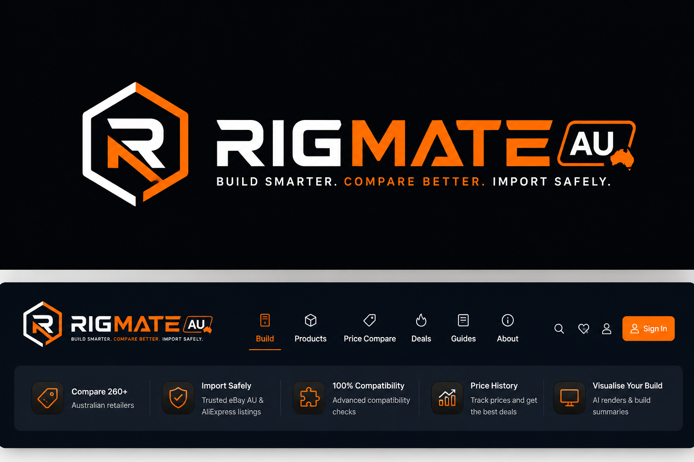

# RigMate AU

<p align="center">
  
</p>

<p align="center">
  Australia-first PC build planning with compatibility checks, marketplace trust signals, and shareable showcase pages.
</p>

<p align="center">
  
</p>

<p align="center">
  
  
  
  
</p>

## What It Is

RigMate AU is a prototype web app for Australian PC builders who want more than a generic part picker. It focuses on the local buying experience:

- compare seeded AU retailer, eBay AU, and AliExpress listings
- flag risky import categories before people save a few dollars in the wrong place
- surface compatibility issues early while a build is still taking shape
- generate a polished public build page that is easier to share than a spreadsheet

> Current status: the product experience is real, but the pricing providers in this repo are still mock/seeded data sources designed to model the marketplace workflow and scoring system.

## Core Features

| Area | What it does |
| --- | --- |
| Builder flow | Select CPUs, motherboards, RAM, GPUs, storage, PSUs, cases, coolers, and fans in a guided editor |
| Compatibility engine | Checks socket, RAM type, form factor, GPU clearance, cooler height, PSU fit, BIOS warnings, and wattage headroom |
| AU price view | Aggregates seeded listings from Scorptec, PC Case Gear, PLE, MSY, Umart, eBay AU, and AliExpress |
| Trust scoring | Adds landed cost, seller trust, warranty risk, delivery speed, and import safety signals |
| Templates | Load prebuilt starter rigs for gaming, workstation, streaming, budget, and content creation use cases |
| Showcase pages | Save a build to a public route with compatibility summary, estimated performance, and print-to-PDF output |

## Why The Angle Matters

Most PC builder tools are US-centric. RigMate AU tries to answer the questions local buyers actually ask:

- Is this part really cheaper once shipping lands in AUD?
- Is AliExpress safe for this category, or is local warranty worth the premium?
- Will this GPU/cooler/case combination physically fit?
- Can I send a clean public build page to a friend without explaining every line item?

## Tech Stack

- Next.js 16 App Router
- React 19
- TypeScript
- Tailwind CSS 4
- Prisma ORM
- SQLite for local development
- Cloudflare D1 + OpenNext for deployment
- Wrangler for edge deployment and local Cloudflare previews

## Project Structure

```text
app/
  api/                  API routes for parts, pricing, compatibility, and builds
  builder/              Interactive builder page
  build/[slug]/         Public build showcase page
components/
  build/                Builder UI, selectors, showcase, compatibility cards
  pricing/              Listing score and retailer price views
lib/
  compatibility/        Rule-based build validation
  pricing/              Listing enrichment and score calculation
  providers/            Marketplace provider interfaces and mock providers
prisma/
  schema.prisma         Data model
  seed.ts               Seeded AU catalog and pricing fixtures
scripts/
  dump-to-d1.mjs        Export local SQLite data into D1-friendly SQL
```

## Local Development

### 1. Install dependencies

```bash
npm install
```

### 2. Start the app

```bash
npm run dev
```

Open `http://localhost:3000`.

### 3. Optional database tasks

```bash
npm run db:migrate
npm run db:seed
npm run db:studio
```

Notes:

- Local development uses SQLite.
- The repo already includes a `dev.db` file for quick startup.
- Prisma client output is generated into `app/generated/prisma`.

## Scripts

| Command | Purpose |
| --- | --- |
| `npm run dev` | Run the Next.js app locally |
| `npm run build` | Production build |
| `npm run start` | Start the production server |
| `npm run lint` | Run ESLint |
| `npm run db:migrate` | Apply Prisma migrations in development |
| `npm run db:seed` | Seed the catalog and mock listing data |
| `npm run db:studio` | Open Prisma Studio |
| `npm run pages:build` | Build for OpenNext/Cloudflare |
| `npm run pages:preview` | Preview the OpenNext worker locally |
| `npm run pages:deploy` | Build and deploy to Cloudflare |

## Cloudflare Deployment

The project is wired for Cloudflare Workers through OpenNext and `wrangler.toml`.

### Main runtime pieces

- D1 database binding: `DB`
- R2 bucket binding: `R2_STORAGE`
- KV namespace binding: `PRICE_CACHE`

### Helpful commands

```bash
npm run pages:build
npm run pages:preview
npm run pages:deploy
```

### Moving local data into D1

```bash
node scripts/dump-to-d1.mjs > prisma/d1-seed.sql
```

Then apply the SQL file with Wrangler against your D1 database.

## Product Notes

### What is real today

- the builder flow and compatibility checks
- the seeded part catalog
- the marketplace scoring and UX around import risk
- public showcase pages and print export

### What still needs production work

- live retailer integrations
- auth and saved user accounts
- historical price tracking beyond seeded fixtures
- automated tests and CI guardrails
- stronger typing around the database facade and route payloads

## Improvement Opportunities

These are the highest-value follow-ups I would tackle after the current prototype:

1. Replace mock providers with real retailer/eBay/AliExpress integrations and cache them aggressively.
2. Tighten TypeScript around the D1 facade so route handlers stop relying on `any`.
3. Refactor the builder effects for React 19 lint compliance and cleaner async state transitions.
4. Add Playwright coverage for the builder, pricing panel, and share flow.
5. Clean up text encoding issues so metadata, labels, and generated content render cleanly everywhere.

## Repository Snapshot

RigMate AU already has a strong product hook, clear audience, and a noticeably more opinionated value proposition than a typical PC picker. The next step is mostly execution polish: better operational correctness, cleaner typing, and production-grade data sources.
